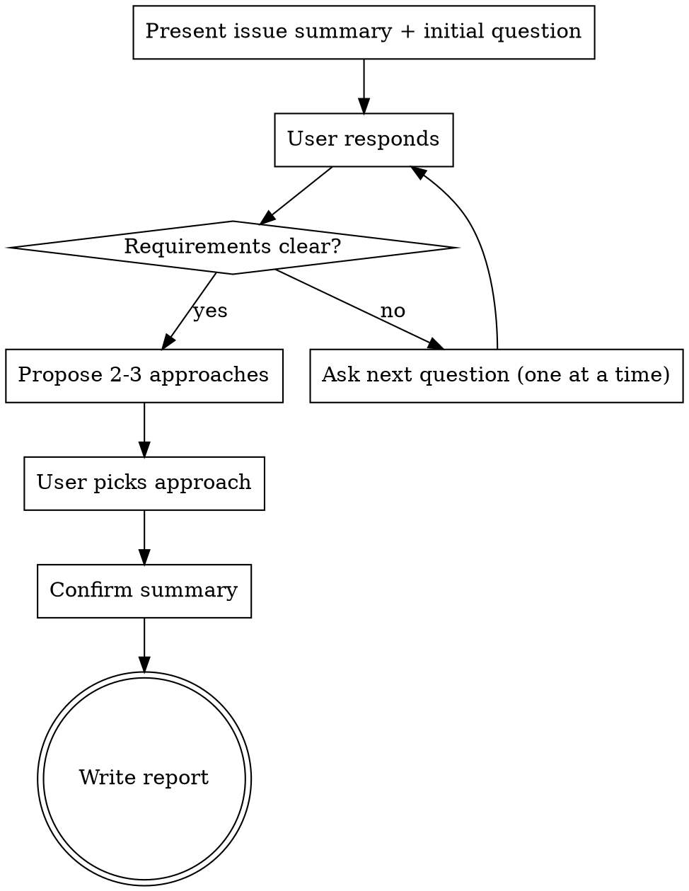

# Issue Interviewer

A rigid skill for requirements discovery through Socratic dialogue. Takes a GitHub issue, researches the codebase, interviews the user, and posts a structured report as an issue comment.

This is a RIGID skill. Follow every stage in order. Do not skip stages.

## Trigger

The user says something like:
- "interview issue #42"
- "explore issue #42"
- "issue interview 42"

Extract the issue number from the user's message.

## Stage 1 — FETCH

1. Fetch the issue: `gh api repos/orbxom/signal-bot/issues/<N>`
2. Extract: title, body, labels, assignees
3. Fetch existing comments: `gh api repos/orbxom/signal-bot/issues/<N>/comments`
4. Check if an interview report already exists (comment body starts with `## Issue Interview Report`)
5. If interview already exists, announce: "Issue #N already has an interview report (posted <date>). Do you want to re-interview?" Wait for user confirmation before continuing. If they decline, stop.

**Announce:** "Fetched issue #N: <title>. Starting research."

## Stage 2 — RESEARCH

Dispatch up to 3 Explore subagents in parallel to build context before asking questions. Encourage subagents to check their available skills.

**Codebase Analyst:**
- Read files relevant to the issue
- Map what needs to change and what's affected
- Identify integration points and risk areas

**Prior Art Reviewer:**
- Check `docs/plans/` for related designs
- Check recent git history for related changes
- Check open GitHub issues/PRs for conflicts or related work

**Docs Researcher** (only if the issue involves external libraries/APIs):
- Use context7 MCP to look up relevant documentation
- Focus on APIs the implementation will use

Synthesize all findings into a brief internal summary. Do NOT share the raw research with the user — use it to ask informed questions.

## Stage 3 — INTERVIEW

Conduct a Socratic interview with the user. The goal is to clarify requirements, explore constraints, and agree on an approach.

### Interview Protocol



### Rules

- **One question at a time.** Never ask multiple questions in one message.
- **Multiple choice preferred.** When you can anticipate likely answers, offer 2-4 options. Open-ended is fine when you genuinely don't know.
- **Research-informed questions.** Use your codebase research to ask specific, grounded questions — not generic ones. Reference actual files, patterns, and constraints you found.
- **Socratic method.** Don't just ask "what do you want?" — probe assumptions, surface hidden requirements, challenge vague answers gently. Ask "why" and "what if" questions.
- **Challenge constructively.** If the user's answer seems to contradict something in the codebase or introduces unnecessary complexity, say so and ask them to reconsider.
- **YAGNI ruthlessly.** If the user starts expanding scope, gently push back: "Do we need that for this issue, or is that a separate concern?"
- **Converge, don't diverge.** The interview should narrow from broad intent to specific requirements. If after 5+ questions you're not converging, synthesize what you know and propose approaches.

### Interview Phases

**Phase 1 — Intent (1-3 questions)**
Start by presenting what the issue says and what you learned from research, then ask about the core intent:
- What problem is this actually solving?
- Who is affected and how?
- Is the issue description accurate and complete?

**Phase 2 — Requirements (2-5 questions)**
Drill into specifics:
- Constraints and boundaries
- Edge cases the issue doesn't mention
- How this interacts with existing functionality
- What "done" looks like

**Phase 3 — Approach (1-3 questions)**
Propose 2-3 approaches based on your research, with trade-offs and your recommendation. Ask the user to pick or suggest alternatives.

**Phase 4 — Confirmation**
Summarize what was agreed:
- The clarified requirements
- The agreed approach
- Success criteria
- Any open questions

Ask: "Does this capture everything? Anything to add or change before I post the report?"

### Red Flags — You're Doing It Wrong

| Symptom | Fix |
|---------|-----|
| Asked 3+ questions in one message | Split into separate messages, one question each |
| Generic questions ("what do you want?") | Use research to ask specific, grounded questions |
| User is expanding scope | Push back with YAGNI |
| 8+ questions asked and still unclear | Synthesize what you know, propose approaches, converge |
| You're assuming the answer | Ask, don't assume. Even if it seems obvious. |
| Skipped research, went straight to questions | Go back. Research makes the interview useful. |

## Stage 4 — REPORT

Write the interview report and post it as a GitHub comment.

### Report Format

The comment MUST start with exactly `## Issue Interview Report` — this is the marker dark-factory uses to detect it.

```markdown
## Issue Interview Report

**Interviewed:** YYYY-MM-DD
**Interviewer context:** <1-2 sentence summary of what was researched>

### Requirements Clarified
- <bullet points of requirements that were clarified or confirmed during the interview>

### Agreed Approach
<the approach decided during the interview, including key architectural decisions>

### Constraints & Edge Cases
- <constraints identified>
- <edge cases discussed>

### Success Criteria
- [ ] <criterion 1>
- [ ] <criterion 2>
- [ ] <criterion 3>

### Open Questions
- <any remaining unknowns — omit section if none>
```

### Posting

1. Format the report as a single string (escape newlines and quotes for the API)
2. Post: `gh api -X POST repos/orbxom/signal-bot/issues/<N>/comments -f body="<report>"`
3. Verify the comment was posted by fetching it back
4. Announce: "Interview report posted to issue #N."

## Rules

- **Never skip research.** Uninformed questions waste the user's time.
- **Never batch questions.** One per message, always.
- **Never skip the confirmation.** The user must approve the summary before posting.
- **Never post without permission.** Always show the report and get approval before posting to GitHub.
- **Use `gh api` instead of `gh issue view`** — the latter fails with GraphQL errors.
